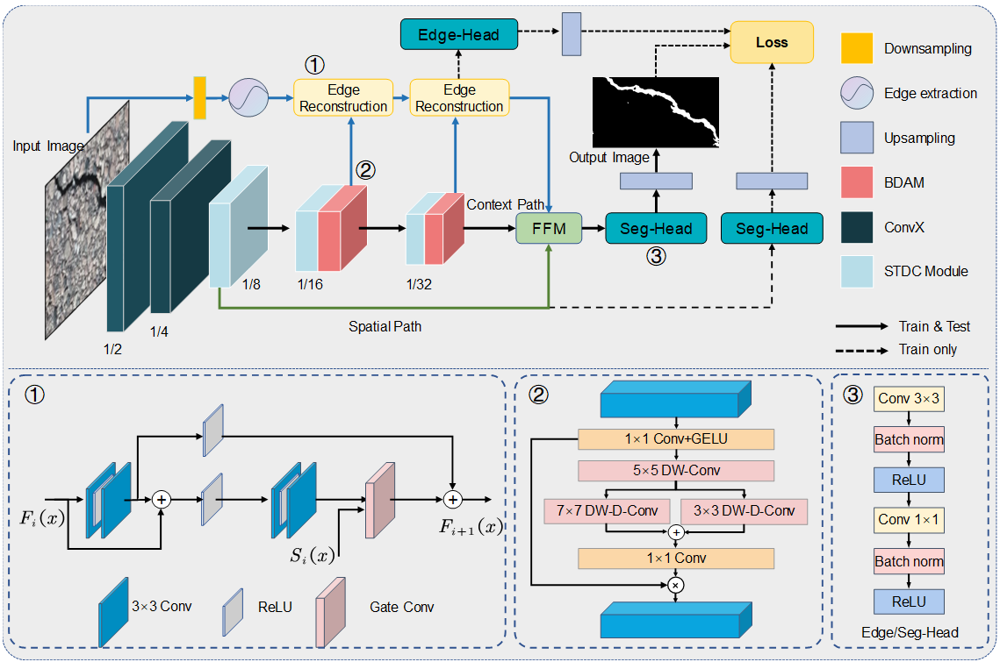

# ERCNet: A Rapid Road Cracks Detection Method from Low-Altitude UAV Remote Sensing Image

> The repository contains official Pytorch implementations of training and evaluation codes for ERCNet.

> The code is based on [MMSegmentaion v0.24.1](https://github.com/open-mmlab/mmsegmentation/tree/v0.24.1).

### Contact
For technical problem, please create an issue.

If you have any private question, please feel free to contact me via duanzexian@nuaa.edu.cn
### Acknowledgment
Our implementation is mainly based on [mmsegmentaion](https://github.com/open-mmlab/mmsegmentation/tree/v0.24.1), [STDC](https://arxiv.org/abs/2104.13188)
### LICENSE
>This repo is under the Apache-2.0 license. For commercial use, please contact the authors.